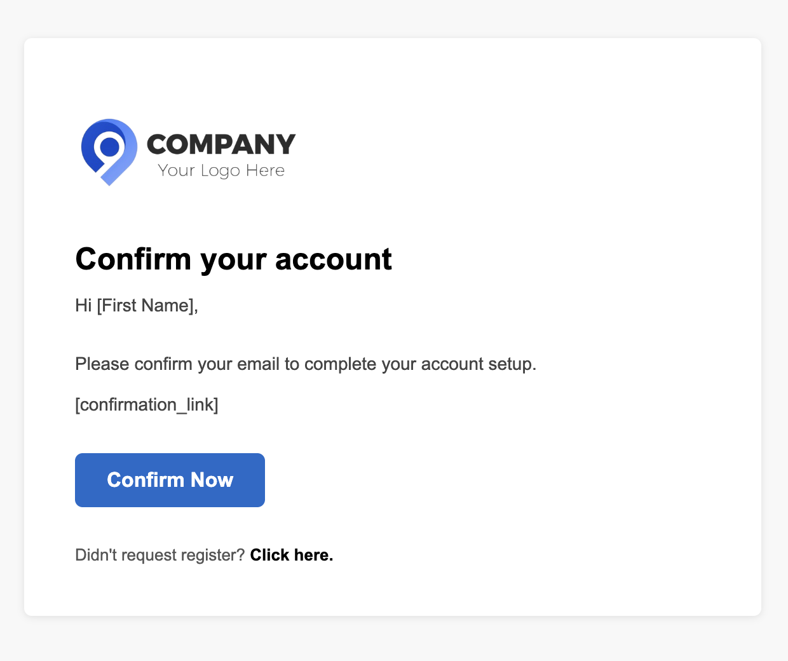
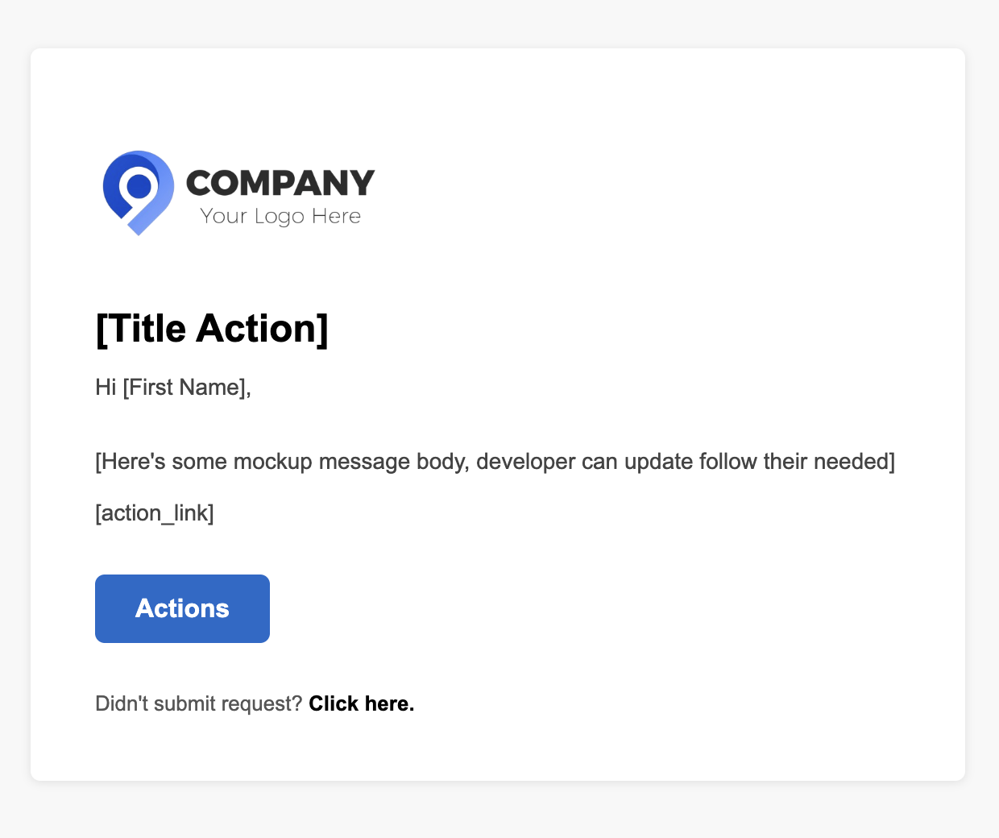

# Go HTML Email Sender

This project demonstrates how to send rich HTML emails in **Golang** using the standard `net/smtp` package and external HTML templates. It's designed for easy integration into any Go-based backend.

## Features

* Load `.html` email templates from disk (`templates/`)
* Inject dynamic data into templates using Go’s `html/template`
* Send styled HTML email using Gmail SMTP

## Project Structure

```
├── main.go                    # Main entry point
├── templates/                 # Email templates
│   └── template.html
```

## Email Template Preview

<div style="display: flex; gap: 10px;">
  
  
</div>

## 🚀 How to Run

### 1. Configure Credentials

Update the following variables in `main.go`:

```go
from := "your_email@gmail.com"
password := "your_app_password"
```

> 💡 Tip: Use `.env` and `godotenv` for security in production.

### 2. Run the Application

```bash
go run main.go
```

## Requirements

* Gmail SMTP or any SMTP server


## Gmail Users Note

If you're using Gmail:

* Enable **App Passwords** under Google Account > Security
* Or allow **"Less secure apps"** (not recommended)


## License

MIT License — free for personal or commercial use.